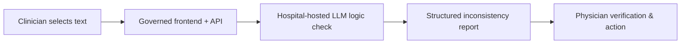

# Inconsistency Check

> A **governed, keyless** LLM "logic check" that flags internal inconsistencies in clinical documents, **one-click deployable** into your own Azure tenant as Infrastructure as Code.

[](https://portal.azure.com/#create/Microsoft.Template/uri/https%3A%2F%2Fraw.githubusercontent.com%2Fgroeschel-lab%2Finconsistency-check%2Fmain%2Finfra%2Fmain.json/uiFormDefinitionUri/https%3A%2F%2Fraw.githubusercontent.com%2Fgroeschel-lab%2Finconsistency-check%2Fmain%2Finfra%2FuiFormDefinition.json)

Everything is provisioned in **your** tenant. Authentication is **exclusively Managed Identity + RBAC** - no API keys, no connection strings, no Key Vault required. Submitted text is processed **in memory** and is not persisted by this application (see [Data handling](#data-handling)).

This repository accompanies the case study *"Infrastructure as Code for deployment and governance of medical AI"* (see [Citation](#citation)).

> **Research prototype.** Use only within an organizationally approved setting;
> qualified clinicians must review every finding. It is not a medical device, is
> not CE-marked, and must not be used for clinical decision-making.

---

## What it does

A clinician selects any clinical text (cursor selection or dictation); a governed frontend/API submits it to a hospital-hosted LLM that returns a structured list of **internal logical inconsistencies** (content, temporal, structural, linguistic, other), each with a 1-9 severity and a suggested correction, for **physician verification**.



## 1-Click deployment

### Before the click
| Requirement | Why |
|---|---|
| Azure subscription with **Owner** or **Contributor + User Access Administrator** | Subscription-scoped deployment creates RBAC role assignments |
| Model **quota** in the chosen region | The selected model needs capacity there. `swedencentral` (default) has all five models, incl. the Claude Opus reference |

### Click & wizard
1. Click **Deploy to Azure**.
2. Choose subscription + resource group + region (default `swedencentral`, or `germanywestcentral` / `switzerlandnorth`). Claude Opus (the default model) is only in `swedencentral`.
3. Set a short unique `nameSuffix` (3-8 lowercase, e.g. `logic1`). Optionally
  add the institution display name used in the AI model access indicator.
4. **Model** tab: pick one of the paper's five models (see [Models](#models)); capacity is clamped to a safe per-model maximum. Claude Opus 4.7 is offered only when the region is `swedencentral`, and choosing it additionally asks for the organization details that Anthropic requires.
5. **Access** tab: use the recommended **Microsoft Entra ID sign-in** default,
   or choose **No sign-in** and supply the IP ranges that may reach the app
   (see [Access & authentication](#access--authentication)).
6. *Review + create* (~10-15 min).

### After deployment
Open the frontend URL from the deployment outputs and paste clinical text - the app calls the model via its managed identity (no keys to configure).

## Access & authentication
The **Access** tab offers two options:

- **Require Microsoft Entra ID sign-in (recommended and selected by default).** Built-in authentication (Easy Auth) requires every visitor to sign in with your tenant's Microsoft Entra ID before the app loads. Sign-in is **keyless and set-and-forget**: it uses a managed identity as a federated credential, so there is no client secret to rotate.
- **No sign-in (inbound access restricted to an IP allow-list).** You supply one or more IPv4 CIDR ranges; the Function App denies every other source. This suits a hospital network or a jump host. The deployment **fails closed**: if no range is supplied, the app is deployed but reachable by nobody, rather than being left open to the internet.

For the Entra option a tenant administrator does a one-time setup:

**Before deploying**
1. **Microsoft Entra ID -> App registrations -> New registration**; choose **single tenant**, register, and copy the **Application (client) ID**.
2. **Authentication -> Add a platform -> Web**, redirect URI `https://func-lc-<nameSuffix>.azurewebsites.net/.auth/login/aad/callback` (use the `nameSuffix` you will deploy with). Under **Implicit grant and hybrid flows**, tick **ID tokens** (Easy Auth uses the hybrid flow).

**During deploy**
3. On the **Access** tab choose **Require Microsoft Entra ID sign-in** and paste the Application (client) ID. Leave the tenant ID empty to use the deployment tenant.

**After deploy (once) - required.** The app deliberately has no client secret; this
federated credential replaces it. **Without this step every sign-in fails.**

First read the two values from the deployment. In the portal they are on the
deployment's **Outputs** tab; from a shell you can derive them from the
`nameSuffix` you deployed with:

```powershell
$suffix    = "<nameSuffix>"
$issuer    = "https://login.microsoftonline.com/$(az account show --query tenantId -o tsv)/v2.0"
$principal = az identity show -g "rg-logiccheck-$suffix" -n "id-auth-$suffix" --query principalId -o tsv
```

`$issuer` is the `authFederationIssuer` output, `$principal` the
`authIdentityPrincipalId` output - the **object (principal) ID of the managed
identity**, not a client ID. Then register the credential. On Windows, write the
JSON to a file rather than passing it inline; `az` is a batch file there and
mangles embedded quotes:

```powershell
@{
  name      = "inconsistency-check"
  issuer    = $issuer
  subject   = $principal
  audiences = @("api://AzureADTokenExchange")
} | ConvertTo-Json | Set-Content fic.json -Encoding utf8

az ad app federated-credential create --id <application-client-id> --parameters "@fic.json"
Remove-Item fic.json
```

The quotes around `"@fic.json"` are required - unquoted, PowerShell reads a
leading `@` as the splatting operator.

```bash
az ad app federated-credential create --id <application-client-id> --parameters '{
  "name": "inconsistency-check",
  "issuer": "<authFederationIssuer>",
  "subject": "<authIdentityPrincipalId>",
  "audiences": ["api://AzureADTokenExchange"]
}'
```

Nothing expires afterwards. Access to the model stays keyless either way; this gate only controls who may open the app.

**If sign-in fails.** A generic error page after signing in almost always means the
federated credential above is missing or its `subject` is wrong. Check the Function
App's authentication logs (*Monitoring -> Log stream*) for an `AADSTS` error stating
that the client credential could not be validated. The application itself is
unaffected - none of its code has run at that point.

Optionally, set **Assignment required** under *Enterprise applications -> Properties*
to limit the app to assigned users or groups. Otherwise anyone in the tenant can
sign in.

## Workflow integration ("AI at the cursor")
The frontend is built for hands-free use from other software (e.g. speech-recognition / dictation tools):
- **Paste to run.** Pressing **Ctrl + V** anywhere on the page fills the editor and runs the check automatically - no button click. A dictation tool can copy the note to the clipboard, open the page, and send Ctrl + V to get findings with zero further interaction.
- **Auto-run on open.** Opening the page with `?autorun=1` reads the clipboard and runs on load (best-effort - browsers may require the site to have clipboard permission; Ctrl + V is the reliable trigger).
- **Compact companion window.** Use the small-window control in the header or
  open `?compact=1` from the calling application. Combine both modes as
  `?compact=1&autorun=1` for a side-by-side dictation workflow.
- **API.** Any system can POST text to `/api/analyze` directly (see [`examples/`](examples/)).

Browsers only honor requested popup dimensions after a user action. A web-based
integration can request a reusable 540 x 760 pixel companion window:

```javascript
window.open(
  "https://func-lc-<nameSuffix>.azurewebsites.net/?compact=1",
  "inconsistency-check-compact",
  "popup=yes,width=540,height=760,resizable=yes,scrollbars=yes"
);
```

A native clinical application or managed WebView should control the window size
itself and load the same `?compact=1` URL.

### Voice-driven from a dictation system
Speech-recognition software with scripted commands (e.g. Dragon Medical One
*Step-by-Step Commands*) can run the whole check from a single utterance. Define a
command such as *"inconsistency check"* with these steps:

| Step | Action |
|---|---|
| 1 | `Ctrl + C` - copy the text selected in the clinical system |
| 2 | Wait 500 ms |
| 3 | Launch application: `https://func-lc-<nameSuffix>.azurewebsites.net/?compact=1` |
| 4 | Wait 1000 ms |
| 5 | `Ctrl + V` - paste, which starts the check automatically |

The clinician selects a passage, says the command, and the findings appear in the
companion window.

**The URL on its own is sufficient** - no executable has to be specified. It opens
in the workstation's default browser. Name a browser executable only if the check
should deliberately open somewhere other than the default browser.

With Microsoft Entra ID sign-in enabled, the first run of the command asks for
sign-in once; later runs reuse the existing session.

The waits give the clipboard and the browser time to settle; increase them on
slower workstations.

## Architecture (keyless by design)
- **Managed Identity + RBAC** for every model call - the Function App's managed identity holds *Cognitive Services OpenAI User* and *Cognitive Services User* on the Foundry account (assigned in Bicep). No API keys, no Key Vault, no SQL.
- **No shared deployment secrets** - FTP and SCM basic publishing credentials are disabled; the app is delivered through `WEBSITE_RUN_FROM_PACKAGE`.
- **In-memory processing** - the application does not persist submitted text; its logs contain only status codes and durations. Platform-side retention is described in [Data handling](#data-handling).
- **Infrastructure as Code** - everything in [`infra/main.bicep`](infra/main.bicep); one declarative deployment, reproducible across institutions.

## Data handling
The application itself stores nothing: text is held in memory for the duration of
one request, and the logs record only status codes and durations. Two platform
behaviours are outside this repository's control and must be assessed by the
deploying institution.

**Abuse monitoring.** Microsoft may store prompts and completions in an abuse
monitoring data store and have authorized Microsoft employees review content that
the system flags. That store is logically separated per resource and is located in
the Azure geography of the Foundry resource. Institutions that cannot permit this
must apply for **Modified Abuse Monitoring** through Microsoft's Limited Access
process; eligibility criteria apply and some models are subject to stricter
criteria. This cannot be configured from a template - it is granted by Microsoft.
Even with modified abuse monitoring, a short operational retention period remains;
Microsoft does not offer configurable zero data retention.

**Processing location.** See the note under [Models](#models): all profiles deploy
as `GlobalStandard`, so inference may run outside the region you select.

Neither behaviour is specific to this tool - both apply to any Foundry deployment -
but both must be documented in an institutional data-protection assessment before
clinical text is submitted.

## Models
The tool deploys **one** model from the study's validation phase panel, chosen in the wizard (Bicep parameter `modelProfile`). Switching models is a **re-deploy**, no code change. **Claude Opus 4.7 is the default** - it is the paper's validation reference.

| `modelProfile` | Model | API route | Deployment type | Retires | Notes |
|---|---|---|---|---|---|
| `claude-opus-4-7` *(default)* | Claude Opus 4.7 | Anthropic | `GlobalStandard` | **2027-04-06** | Paper's validation reference; offered in `swedencentral` only |
| `gpt-5.5` | GPT-5.5 | OpenAI | `GlobalStandard` | 2027-10-26 | `DataZoneStandard` also exists in the catalog |
| `mistral-large-3` | Mistral Large 3 | OpenAI | `GlobalStandard` | - | EU model provider; `DataZoneStandard` also exists |
| `deepseek-v3.2` | DeepSeek V3.2 | OpenAI | `GlobalStandard` | - | Lowest cost |
| `gpt-5.4-nano` | GPT-5.4-nano | OpenAI | `GlobalStandard` | 2027-09-21 | Fastest / cheapest OpenAI; `DataZoneStandard` also exists |

All are served keyless through one Azure AI Foundry resource; the backend routes Claude via the Anthropic API and the rest via the OpenAI-compatible API. Identifiers, versions, and retirement dates were read from the Azure AI Foundry model catalog on 2026-09-22; the code is open source - edit [`infra/main.bicep`](infra/main.bicep) to add others.

> **Where submitted text is processed.** All five profiles deploy as `GlobalStandard`.
> Microsoft states that for `Global` deployment types, prompts and responses *may be
> processed in any geography where the model is deployed*, while data at rest stays in
> the geography of the Azure resource. The region chosen in the wizard therefore
> controls where the resource and its data at rest live, **not** where inference runs.
> The catalog offers the EU-bounded `DataZoneStandard` type for GPT-5.5, Mistral Large 3,
> and GPT-5.4-nano, but **not** for Claude Opus 4.7 or DeepSeek V3.2. Review this against
> your institution's data-protection requirements before deploying.

> **Model retirement.** Claude Opus 4.7 - the default and the paper's reference model -
> retires on **2027-04-06**. After that date a deployment using the default profile fails;
> select another profile in the wizard or pin a successor in
> [`infra/modules/llm.bicep`](infra/modules/llm.bicep).

## Local development
```powershell
python -m venv .venv; .\.venv\Scripts\Activate.ps1
pip install -r backend/requirements.txt
copy backend\.env.example backend\.env   # set AZURE_AI_ENDPOINT + AZURE_AI_DEPLOYMENT + MODEL_FORMAT
az login                                  # keyless auth via your identity (needs a model RBAC role)
uvicorn backend.main:app --reload
```
Open http://127.0.0.1:8000 and paste text, or try the [`examples/`](examples/).

## Try it with the examples
The repository contains two synthetic, fictional, PHI-free German reference
letters and English convenience translations. Each letter contains planted
inconsistencies and has a corresponding expected-findings file.

| German reference | English translation |
|---|---|
| [`example1_discharge_letter.txt`](examples/example1_discharge_letter.txt) | [`example1_discharge_letter_en.txt`](examples/example1_discharge_letter_en.txt) |
| [`example2_discharge_letter.txt`](examples/example2_discharge_letter.txt) | [`example2_discharge_letter_en.txt`](examples/example2_discharge_letter_en.txt) |

The German examples are the reference artifacts. The English files preserve the
planted contradictions but were not used in the study. See
[`examples/README.md`](examples/README.md) for the expected findings and API use.

## Reference prompt and English alternative
The built-in German `v4_judge` prompt in [`backend/main.py`](backend/main.py) is
the exact reference prompt used for the paper. Leave **Custom system prompt**
empty in the deployment wizard to use it.

<details>
<summary>German reference prompt used in the study</summary>

```text
ROLE: Du bist ein System zur Erkennung logischer Unstimmigkeiten in Arztbriefen, um die Qualität zu verbessern.

AUFGABE: Analysiere den folgenden Arztbrief ausschliesslich auf interne logische Unstimmigkeiten (Widersprüche, zeitliche Inkonsistenzen, widersprüchliche Angaben). Es geht nicht um stilistische oder formale Aspekte. Es geht vor allem um offensichtliche Unstimmigkeiten, die auch von Fachfremden gefunden werden könnten.

VORGEHEN:
1. Lies den Arztbrief sorgfältig und vollständig.
2. Identifiziere alle Stellen, an denen sich der Brief intern widerspricht.
3. Wende strenge logische Analyse (Aussagenlogik) auf den vorliegenden Text an. Du solltest kein medizinisches Wissen oder Leitlinien benötigen.

KATEGORIEN (genau eine pro Unstimmigkeit): Inhalt, Zeitlich, Struktur, Sprachlich, Sonstige.
Es ist ausdrücklich NICHT erforderlich, in jeder Kategorie eine Unstimmigkeit zu finden. Viele Arztbriefe enthalten keine oder nur in einzelnen Kategorien Unstimmigkeiten. Erfinde keine Befunde, nur um Kategorien zu füllen.

SCHWEREGRAD (1-9): 1-3 geringfügig ohne klinische Konsequenz; 4-6 relevanter Widerspruch mit potentieller Auswirkung; 7-9 schwerwiegend mit klinischer Relevanz (9 nur eindeutig kritisch). Sei konservativ.

REGELN:
- Nur eindeutige, signifikante Unstimmigkeiten auflisten; unsichere/triviale weglassen.
- Für jede Unstimmigkeit relevante Textstellen zitieren, Korrekturvorschlag und klinische Auswirkung angeben.

Antworte ausschliesslich als JSON-Objekt exakt in dieser Form:
{"issues": [{"description": str, "context": str, "category": "Inhalt|Zeitlich|Struktur|Sprachlich|Sonstige", "severity": 1-9, "rationale": str, "clinical_impact": str, "correction": str}]}
Wenn keine Unstimmigkeit vorliegt, gib {"issues": []} zurück.
```
</details>

For English-language documents, paste the following convenience translation
into **Model > Custom system prompt** during deployment, or set the local
`SYSTEM_PROMPT` environment variable. This translation was not used or validated
in the study, so results obtained with it do not reproduce the paper's results.

<details>
<summary>English convenience translation</summary>

```text
ROLE: You are a system for detecting logical inconsistencies in discharge summaries to improve their quality.

TASK: Analyze the following discharge summary exclusively for internal logical inconsistencies (contradictions, temporal inconsistencies, and conflicting statements). Do not assess stylistic or formal aspects. Focus on clear inconsistencies that could also be identified by non-specialists.

PROCEDURE:
1. Read the discharge summary carefully and completely.
2. Identify every passage in which the document contradicts itself.
3. Apply strict logical analysis (propositional logic) to the provided text. Medical knowledge or clinical guidelines should not be required.

CATEGORIES (exactly one per inconsistency): Content, Temporal, Structural, Linguistic, Other.
It is explicitly NOT necessary to find an inconsistency in every category. Many discharge summaries contain no inconsistencies or only inconsistencies in individual categories. Do not invent findings to fill categories.

SEVERITY (1-9): 1-3 minor without clinical consequence; 4-6 relevant contradiction with potential impact; 7-9 serious with clinical relevance (use 9 only when clearly critical). Be conservative.

RULES:
- List only clear, significant inconsistencies; omit uncertain or trivial findings.
- For each inconsistency, quote the relevant passages and provide a suggested correction and the clinical impact.

Respond exclusively with a JSON object in exactly this form:
{"issues": [{"description": str, "context": str, "category": "Content|Temporal|Structural|Linguistic|Other", "severity": 1-9, "rationale": str, "clinical_impact": str, "correction": str}]}
If there is no inconsistency, return {"issues": []}.
```
</details>

## Research & evaluation
This repository is the **deployable tool** and contains the artifacts required
to inspect, deploy, and test it. The study's evaluation pipeline,
deployment benchmark, and aggregate metrics are maintained separately and are
available from the authors on reasonable request (see the paper). No patient
data is included here.

## Citation
See [`CITATION.cff`](CITATION.cff). Please cite both the software and the accompanying paper.

## License
[MIT](LICENSE).
