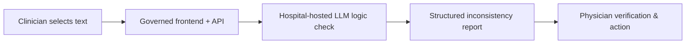

# Inconsistency Check

> A **governed, keyless** LLM "logic check" that flags internal inconsistencies in clinical documents, **one-click deployable** into your own Azure tenant as Infrastructure as Code.

[](https://portal.azure.com/#create/Microsoft.Template/uri/https%3A%2F%2Fraw.githubusercontent.com%2Fgroeschel-lab%2Finconsistency-check%2Fmain%2Finfra%2Fmain.json/uiFormDefinitionUri/https%3A%2F%2Fraw.githubusercontent.com%2Fgroeschel-lab%2Finconsistency-check%2Fmain%2Finfra%2FuiFormDefinition.json)

Everything is provisioned in **your** tenant. Authentication is **exclusively Managed Identity + RBAC** - no API keys, no connection strings, no Key Vault required. Submitted text is processed **in memory** and not persisted.

This repository accompanies the case study *"Infrastructure as Code for deployment and governance of medical AI"* (see [Citation](#citation)).

> **Research prototype.** Use only within an organizationally approved setting;
> qualified clinicians must review every finding. Submitted text is processed
> in memory and not persisted.

---

## What it does

A clinician selects any clinical text (cursor selection or dictation); a governed frontend/API submits it to a hospital-hosted LLM that returns a structured list of **internal logical inconsistencies** (content, temporal, structural, linguistic, other), each with a 1-9 severity and a suggested correction, for **physician verification**.



## 1-Click deployment

> **Public repository required.** The deployment button loads the ARM template,
> portal form, and release package from GitHub without repository authentication.
> It therefore works only after this repository is public and a release provides
> the `app.zip` asset. During private staging, code can be uploaded and reviewed
> normally, but the deployment button will return `404`.

### Before the click
| Requirement | Why |
|---|---|
| Azure subscription with **Owner** or **Contributor + User Access Administrator** | Subscription-scoped deployment creates RBAC role assignments |
| Model **quota** in the chosen region | The selected model needs capacity there. `swedencentral` (default) has all five models, incl. the Claude Opus reference |

### Click & wizard
1. Click **Deploy to Azure**.
2. Choose subscription + resource group + region (default `swedencentral`, or `germanywestcentral` / `switzerlandnorth`). Claude Opus (the default model) is only in `swedencentral`.
3. Set a short unique `nameSuffix` (3-8 lowercase, e.g. `logic1`). Optionally
  add the institution display name used in the AI model access indicator.
4. **Model** tab: pick one of the paper's five models (see [Models](#models)); capacity is clamped to a safe per-model maximum.
5. **Access** tab: use the recommended **Microsoft Entra ID sign-in** default,
   or deliberately choose **No sign-in** if your IT team will control network
   access separately (see [Access & authentication](#access--authentication)).
6. *Review + create* (~10-15 min).

### After deployment
Open the frontend URL from the deployment outputs and paste clinical text - the app calls the model via its managed identity (no keys to configure).

## Access & authentication
The **Access** tab offers two options:

- **Require Microsoft Entra ID sign-in (recommended and selected by default).** Built-in authentication (Easy Auth) requires every visitor to sign in with your tenant's Microsoft Entra ID before the app loads. Sign-in is **keyless and set-and-forget**: it uses a managed identity as a federated credential, so there is no client secret to rotate.
- **No sign-in (configure network access separately).** The template does not add an inbound network restriction to the Function App. Without controls configured by the deploying IT team, the app is publicly reachable. Use this option only for an approved evaluation environment or when separate network controls are in place.

For the Entra option a tenant administrator does a one-time setup:

**Before deploying**
1. **Microsoft Entra ID -> App registrations -> New registration**; choose **single tenant**, register, and copy the **Application (client) ID**.
2. **Authentication -> Add a platform -> Web**, redirect URI `https://func-lc-<nameSuffix>.azurewebsites.net/.auth/login/aad/callback` (use the `nameSuffix` you will deploy with). Under **Implicit grant and hybrid flows**, tick **ID tokens** (Easy Auth uses the hybrid flow).

**During deploy**
3. On the **Access** tab choose **Require Microsoft Entra ID sign-in** and paste the Application (client) ID. Leave the tenant ID empty to use the deployment tenant.

**After deploy (once)** - trust the app's managed identity so no secret is needed. Use the deployment outputs `authFederationIssuer` and `authIdentityPrincipalId`:
```bash
az ad app federated-credential create --id <application-client-id> --parameters '{
  "name": "inconsistency-check",
  "issuer": "<authFederationIssuer>",
  "subject": "<authIdentityPrincipalId>",
  "audiences": ["api://AzureADTokenExchange"]
}'
```
Nothing expires afterwards. Access to the model stays keyless either way; this gate only controls who may open the app.

## Workflow integration ("AI at the cursor")
The frontend is built for hands-free use from other software (e.g. speech-recognition / dictation tools):
- **Paste to run.** Pressing **Ctrl + V** anywhere on the page fills the editor and runs the check automatically - no button click. A dictation tool can copy the note to the clipboard, open the page, and send Ctrl + V to get findings with zero further interaction.
- **Auto-run on open.** Opening the page with `?autorun=1` reads the clipboard and runs on load (best-effort - browsers may require the site to have clipboard permission; Ctrl + V is the reliable trigger).
- **Compact companion window.** Use the small-window control in the header or
  open `?compact=1` from the calling application. Combine both modes as
  `?compact=1&autorun=1` for a side-by-side dictation workflow.
- **API.** Any system can POST text to `/api/analyze` directly (see [`examples/`](examples/)).

Browsers only honor requested popup dimensions after a user action. A web-based
integration can request a reusable 540 x 760 pixel companion window:

```javascript
window.open(
  "https://func-lc-<nameSuffix>.azurewebsites.net/?compact=1",
  "inconsistency-check-compact",
  "popup=yes,width=540,height=760,resizable=yes,scrollbars=yes"
);
```

A native clinical application or managed WebView should control the window size
itself and load the same `?compact=1` URL.

## Architecture (keyless by design)
- **Managed Identity + RBAC** for every model call - the Function App's managed identity holds *Cognitive Services OpenAI User* and *Cognitive Services User* on the Foundry account (assigned in Bicep). No API keys, no Key Vault, no SQL.
- **In-memory processing** - submitted text is not persisted; logs contain only status codes and durations.
- **Infrastructure as Code** - everything in [`infra/main.bicep`](infra/main.bicep); one declarative deployment, reproducible across institutions.

## Models
The tool deploys **one** model from the study's validation phase panel, chosen in the wizard (Bicep parameter `modelProfile`). Switching models is a **re-deploy**, no code change. **Claude Opus 4.7 is the default** - it is the paper's validation reference.

| `modelProfile` | Model | Route | Region | Notes |
|---|---|---|---|---|
| `claude-opus-4-7` *(default)* | Claude Opus 4.7 | Anthropic | swedencentral only | Paper's validation reference |
| `gpt-5.5` | GPT-5.5 | OpenAI | EU regions | |
| `mistral-large-3` | Mistral Large 3 | OpenAI | EU regions | EU model provider |
| `deepseek-v3.2` | DeepSeek V3.2 | OpenAI | EU regions | Lowest cost |
| `gpt-5.4-nano` | GPT-5.4-nano | OpenAI | EU regions | Fastest / cheapest OpenAI |

All are served keyless through one Azure AI Foundry resource; the backend routes Claude via the Anthropic API and the rest via the OpenAI-compatible API. Identifiers and versions were verified against the live Foundry catalog in `swedencentral`; the code is open source - edit [`infra/main.bicep`](infra/main.bicep) to add others.

## Local development
```powershell
python -m venv .venv; .\.venv\Scripts\Activate.ps1
pip install -r backend/requirements.txt
copy backend\.env.example backend\.env   # set AZURE_AI_ENDPOINT + AZURE_AI_DEPLOYMENT + MODEL_FORMAT
az login                                  # keyless auth via your identity (needs a model RBAC role)
uvicorn backend.main:app --reload
```
Open http://127.0.0.1:8000 and paste text, or try the [`examples/`](examples/).

## Try it with the examples
The repository contains two synthetic, fictional, PHI-free German reference
letters and English convenience translations. Each letter contains planted
inconsistencies and has a corresponding expected-findings file.

| German reference | English translation |
|---|---|
| [`example1_discharge_letter.txt`](examples/example1_discharge_letter.txt) | [`example1_discharge_letter_en.txt`](examples/example1_discharge_letter_en.txt) |
| [`example2_discharge_letter.txt`](examples/example2_discharge_letter.txt) | [`example2_discharge_letter_en.txt`](examples/example2_discharge_letter_en.txt) |

The German examples are the reference artifacts. The English files preserve the
planted contradictions but were not used in the study. See
[`examples/README.md`](examples/README.md) for the expected findings and API use.

## Reference prompt and English alternative
The built-in German `v4_judge` prompt in [`backend/main.py`](backend/main.py) is
the exact reference prompt used for the paper. Leave **Custom system prompt**
empty in the deployment wizard to use it.

<details>
<summary>German reference prompt used in the study</summary>

```text
ROLE: Du bist ein System zur Erkennung logischer Unstimmigkeiten in Arztbriefen, um die Qualität zu verbessern.

AUFGABE: Analysiere den folgenden Arztbrief ausschliesslich auf interne logische Unstimmigkeiten (Widersprüche, zeitliche Inkonsistenzen, widersprüchliche Angaben). Es geht nicht um stilistische oder formale Aspekte. Es geht vor allem um offensichtliche Unstimmigkeiten, die auch von Fachfremden gefunden werden könnten.

VORGEHEN:
1. Lies den Arztbrief sorgfältig und vollständig.
2. Identifiziere alle Stellen, an denen sich der Brief intern widerspricht.
3. Wende strenge logische Analyse (Aussagenlogik) auf den vorliegenden Text an. Du solltest kein medizinisches Wissen oder Leitlinien benötigen.

KATEGORIEN (genau eine pro Unstimmigkeit): Inhalt, Zeitlich, Struktur, Sprachlich, Sonstige.
Es ist ausdrücklich NICHT erforderlich, in jeder Kategorie eine Unstimmigkeit zu finden. Viele Arztbriefe enthalten keine oder nur in einzelnen Kategorien Unstimmigkeiten. Erfinde keine Befunde, nur um Kategorien zu füllen.

SCHWEREGRAD (1-9): 1-3 geringfügig ohne klinische Konsequenz; 4-6 relevanter Widerspruch mit potentieller Auswirkung; 7-9 schwerwiegend mit klinischer Relevanz (9 nur eindeutig kritisch). Sei konservativ.

REGELN:
- Nur eindeutige, signifikante Unstimmigkeiten auflisten; unsichere/triviale weglassen.
- Für jede Unstimmigkeit relevante Textstellen zitieren, Korrekturvorschlag und klinische Auswirkung angeben.

Antworte ausschliesslich als JSON-Objekt exakt in dieser Form:
{"issues": [{"description": str, "context": str, "category": "Inhalt|Zeitlich|Struktur|Sprachlich|Sonstige", "severity": 1-9, "rationale": str, "clinical_impact": str, "correction": str}]}
Wenn keine Unstimmigkeit vorliegt, gib {"issues": []} zurück.
```
</details>

For English-language documents, paste the following convenience translation
into **Model > Custom system prompt** during deployment, or set the local
`SYSTEM_PROMPT` environment variable. This translation was not used or validated
in the study, so results obtained with it do not reproduce the paper's results.

<details>
<summary>English convenience translation</summary>

```text
ROLE: You are a system for detecting logical inconsistencies in discharge summaries to improve their quality.

TASK: Analyze the following discharge summary exclusively for internal logical inconsistencies (contradictions, temporal inconsistencies, and conflicting statements). Do not assess stylistic or formal aspects. Focus on clear inconsistencies that could also be identified by non-specialists.

PROCEDURE:
1. Read the discharge summary carefully and completely.
2. Identify every passage in which the document contradicts itself.
3. Apply strict logical analysis (propositional logic) to the provided text. Medical knowledge or clinical guidelines should not be required.

CATEGORIES (exactly one per inconsistency): Content, Temporal, Structural, Linguistic, Other.
It is explicitly NOT necessary to find an inconsistency in every category. Many discharge summaries contain no inconsistencies or only inconsistencies in individual categories. Do not invent findings to fill categories.

SEVERITY (1-9): 1-3 minor without clinical consequence; 4-6 relevant contradiction with potential impact; 7-9 serious with clinical relevance (use 9 only when clearly critical). Be conservative.

RULES:
- List only clear, significant inconsistencies; omit uncertain or trivial findings.
- For each inconsistency, quote the relevant passages and provide a suggested correction and the clinical impact.

Respond exclusively with a JSON object in exactly this form:
{"issues": [{"description": str, "context": str, "category": "Content|Temporal|Structural|Linguistic|Other", "severity": 1-9, "rationale": str, "clinical_impact": str, "correction": str}]}
If there is no inconsistency, return {"issues": []}.
```
</details>

## Research & evaluation
This repository is the **deployable tool** and contains the artifacts required
to inspect, deploy, and test it. The study's evaluation pipeline,
deployment benchmark, and aggregate metrics are maintained separately and are
available from the authors on reasonable request (see the paper). No patient
data is included here.

## Citation
See [`CITATION.cff`](CITATION.cff). Please cite both the software and the accompanying paper.

## License
[MIT](LICENSE).
