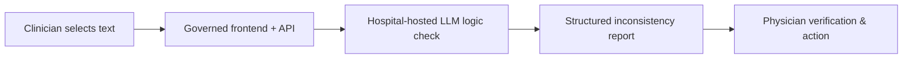

# Inconsistency Check

> A **governed, keyless** LLM "logic check" that flags internal inconsistencies in clinical documents (discharge summaries), **one-click deployable** into your own Azure tenant as Infrastructure as Code.

[](https://portal.azure.com/#create/Microsoft.Template/uri/https%3A%2F%2Fraw.githubusercontent.com%2Fhelloworld-germany%2Finconsistency-check%2Fmain%2Finfra%2Fmain.json/uiFormDefinitionUri/https%3A%2F%2Fraw.githubusercontent.com%2Fhelloworld-germany%2Finconsistency-check%2Fmain%2Finfra%2FuiFormDefinition.json)

Everything is provisioned in **your** tenant. Authentication is **exclusively Managed Identity + RBAC** - no API keys, no connection strings, no Key Vault required. Submitted text is processed **in memory** and not persisted.

This repository accompanies the case study *"Implementing a Governed LLM Logic Check for Hospital Documentation"* (see [Citation](#citation)).

> ⚠️ **Not a medical device** (MDR/IVDR). All flagged inconsistencies must be verified by qualified clinicians.

---

## What it does

A clinician selects any clinical text (cursor selection or dictation); a governed frontend/API submits it to a hospital-hosted LLM that returns a structured list of **internal logical inconsistencies** (content, temporal, structural, linguistic, other), each with a 1-9 severity and a suggested correction, for **physician verification**.



## 1-Click deployment

### Before the click
| Requirement | Why |
|---|---|
| Azure subscription with **Owner** or **Contributor + User Access Administrator** | Subscription-scoped deployment creates RBAC role assignments |
| Model **quota** in the chosen region | The selected model needs capacity there. `swedencentral` (default) has all five models, incl. the Claude Opus reference |

### Click & wizard
1. Click **Deploy to Azure**.
2. Choose subscription + resource group + region (default `swedencentral`, or `germanywestcentral` / `switzerlandnorth`). Claude Opus (the default model) is only in `swedencentral`.
3. Set a short unique `nameSuffix` (3-8 lowercase, e.g. `logic1`).
4. **Model** tab: pick one of the paper's five models (see [Models](#models)); capacity is clamped to a safe per-model maximum.
5. **Access** tab: choose **No sign-in** or **Require Microsoft Entra ID sign-in** (see [Access & authentication](#access--authentication)).
6. *Review + create* (~10-15 min).

### After deployment
Open the frontend URL from the deployment outputs and paste clinical text - the app calls the model via its managed identity (no keys to configure).

## Access & authentication
The **Access** tab offers two one-click options:

- **No sign-in (restrict by network).** No login gate; control who can reach the app at the network layer (private endpoints, IP allow-list). Suitable when the app is only reachable from inside the hospital network.
- **Require Microsoft Entra ID sign-in.** Built-in authentication (Easy Auth) requires every visitor to sign in with your tenant's Microsoft Entra ID before the app loads. Sign-in is **keyless and set-and-forget**: it uses a managed identity as a federated credential, so there is no client secret to rotate.

For the Entra option a tenant administrator does a one-time setup:

**Before deploying**
1. **Microsoft Entra ID -> App registrations -> New registration**; choose **single tenant**, register, and copy the **Application (client) ID**.
2. **Authentication -> Add a platform -> Web**, redirect URI `https://func-lc-<nameSuffix>.azurewebsites.net/.auth/login/aad/callback` (use the `nameSuffix` you will deploy with). Under **Implicit grant and hybrid flows**, tick **ID tokens** (Easy Auth uses the hybrid flow).

**During deploy**
3. On the **Access** tab choose **Require Microsoft Entra ID sign-in** and paste the Application (client) ID. Leave the tenant ID empty to use the deployment tenant.

**After deploy (once)** - trust the app's managed identity so no secret is needed. Use the deployment outputs `authFederationIssuer` and `authIdentityPrincipalId`:
```bash
az ad app federated-credential create --id <application-client-id> --parameters '{
  "name": "inconsistency-check",
  "issuer": "<authFederationIssuer>",
  "subject": "<authIdentityPrincipalId>",
  "audiences": ["api://AzureADTokenExchange"]
}'
```
Nothing expires afterwards. Access to the model stays keyless either way; this gate only controls who may open the app.

## Workflow integration ("AI at the cursor")
The frontend is built for hands-free use from other software (e.g. speech-recognition / dictation tools):
- **Paste to run.** Pressing **Ctrl + V** anywhere on the page fills the editor and runs the check automatically - no button click. A dictation tool can copy the note to the clipboard, open the page, and send Ctrl + V to get findings with zero further interaction.
- **Auto-run on open.** Opening the page with `?autorun=1` reads the clipboard and runs on load (best-effort - browsers may require the site to have clipboard permission; Ctrl + V is the reliable trigger).
- **API.** Any system can POST text to `/api/analyze` directly (see [`examples/`](examples/)).

## Architecture (keyless by design)
- **Managed Identity + RBAC** for every model call - the Function App's managed identity holds *Cognitive Services OpenAI User* and *Cognitive Services User* on the Foundry account (assigned in Bicep). No API keys, no Key Vault, no SQL.
- **In-memory processing** - submitted text is not persisted; logs contain only status codes and durations.
- **Infrastructure as Code** - everything in [`infra/main.bicep`](infra/main.bicep); one declarative deployment, reproducible across institutions.

## Models
The tool deploys **one** model from the study's Phase-2 panel, chosen in the wizard (Bicep parameter `modelProfile`). Switching models is a **re-deploy**, no code change. **Claude Opus 4.7 is the default** - it is the paper's validation reference.

| `modelProfile` | Model | Route | Region | Notes |
|---|---|---|---|---|
| `claude-opus-4-7` *(default)* | Claude Opus 4.7 | Anthropic | swedencentral only | Paper's validation reference |
| `gpt-5.5` | GPT-5.5 | OpenAI | EU regions | |
| `mistral-large-3` | Mistral Large 3 | OpenAI | EU regions | EU model provider |
| `deepseek-v3.2` | DeepSeek V3.2 | OpenAI | EU regions | Lowest cost |
| `gpt-5.4-nano` | GPT-5.4-nano | OpenAI | EU regions | Fastest / cheapest OpenAI |

All are served keyless through one Azure AI Foundry resource; the backend routes Claude via the Anthropic API and the rest via the OpenAI-compatible API. Identifiers and versions were verified against the live Foundry catalog in `swedencentral`; the code is open source - edit [`infra/main.bicep`](infra/main.bicep) to add others.

## Local development
```powershell
python -m venv .venv; .\.venv\Scripts\Activate.ps1
pip install -r backend/requirements.txt
copy backend\.env.example backend\.env   # set AZURE_AI_ENDPOINT + AZURE_AI_DEPLOYMENT + MODEL_FORMAT
az login                                  # keyless auth via your identity (needs a model RBAC role)
uvicorn backend.main:app --reload
```
Open http://127.0.0.1:8000 and paste text, or try the [`examples/`](examples/).

## Try it with the examples
Two synthetic, fictional, PHI-free discharge letters with planted inconsistencies are in [`examples/`](examples/) - paste one into the app to see the output, or use them for a smoke test.

## Reproducing deployment timing
The paper benchmark is implemented in [`deployment-benchmark.ipynb`](deployment-benchmark.ipynb). In Sweden Central, each of the five paper models is deployed once per randomized block for five blocks (25 fresh, serial attempts). Serial execution prevents benchmark-induced quota or control-plane contention; block randomization reduces order and time-of-day bias.

Open the notebook with a Python kernel and run the cells in order. The default `EXECUTE = False` performs only the preflight checks and displays the deterministic run order. A campaign requires a clean, pushed protocol version and an explicit change to `EXECUTE = True`.

There is one reported endpoint: the first valid result from `POST /api/analyze` using a synthetic, PHI-free probe. The clock starts immediately before Azure CLI submits the commit-pinned GitHub ARM template and stops when that model result arrives. This demonstrates operational readiness of the app, private networking, managed identity, RBAC, model deployment, and inference in one clinically understandable measure. Preflight and cleanup are excluded.

The checkpointed JSON report contains every attempt plus, per model, the arithmetic mean, sample standard deviation, range, and all five observations. Failures and 30-minute timeouts remain in the denominator and are never replaced. The report also records the run order and seed, timestamps, measurement site, exact Git commit and template hash, release-package hash, and runtime environment.

For a protocol-compliant run, use a clean, pushed checkout; retain the prespecified settings; record the approximate client location and network type; ensure quota for all models; and avoid unrelated deployments in the subscription. The notebook verifies the pinned GitHub inputs before measurement. After each attempt, it removes the model deployment, deletes and purges the Foundry account to release quota, and then synchronously deletes the remaining resource group and subscription deployment record before starting the next attempt. A completed campaign therefore leaves no benchmark resources or deployment records. An interrupted process may require the notebook's recovery cell.

The experiment quantifies automated deployment-to-model-response time after the equivalent of the portal's final **Create** action. It does not measure portal form entry or establish usability for technically inexperienced clinicians; that requires a separate user study.

The [final descriptive results](deployment-benchmark-results/final/report.md) comprise 24 completed deployments. The median time to the first valid model response was 234.9 seconds (range 150.7-953.1 seconds), with differing dispersion across model configurations.

## Research & evaluation
This repository is the **deployable tool** only. The study's evaluation pipeline and PHI-free aggregate metrics are maintained separately and are available from the authors on reasonable request (see the paper). No patient data is included here.

## Citation
See [`CITATION.cff`](CITATION.cff). Please cite both the software and the accompanying paper.

## License
[MIT](LICENSE).
