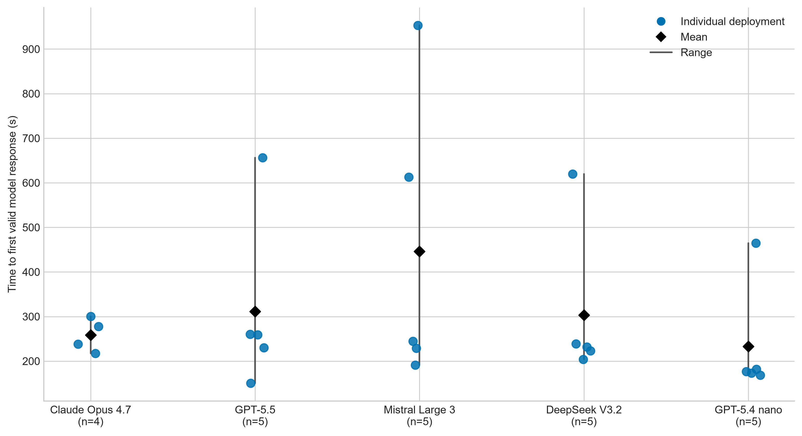

# Deployment-to-model-response time

The complete IaC deployment reached its first valid model response within minutes rather than days. Across 24 completed deployments, the median was 234.9 s and the range was 150.7–953.1 s. Model-specific dispersion differed, as shown below.

| Model | n | Mean (s) | Sample SD (s) | Median (s) | Range (s) |
|---|---:|---:|---:|---:|---:|
| Claude Opus 4.7 | 4 | 258.3 | 37.6 | 257.6 | 217.3–300.5 |
| GPT-5.5 | 5 | 311.2 | 198.1 | 258.8 | 150.7–656.6 |
| Mistral Large 3 | 5 | 445.9 | 330.8 | 244.4 | 191.0–953.1 |
| DeepSeek V3.2 | 5 | 303.5 | 177.2 | 231.9 | 203.6–619.6 |
| GPT-5.4 nano | 5 | 232.9 | 129.6 | 176.4 | 168.7–464.6 |

**Figure.** Time from submission of the commit-pinned ARM template to the first valid model response. Points show individual deployments, diamonds show arithmetic means, and vertical lines show ranges.

The chronologically first five completed measurements per model were used; four completed measurements were available for Claude Opus 4.7. No value was imputed.
